# Mobile Banking Application — PKPL 2026

**Kelompok:** PKPassword123! 

**Anggota:**
> | Nama | NPM |
> |------|-----|
> | Abigail Namaratonggi Pasaribu | 2406495773 |
> | Kanayra Maritza Sanika Adeeva | 2406437880 | 
> | Tsaniya Fini Ardiyanti | 2406437893 | 
> | Zhafira Uzma | 2406495451 | 
> | Zita Nayra Ardini | 2406404913 |

---

## 1. Laporan Unit Testing

### Metodologi
Unit testing dilakukan menggunakan Django Test Framework dengan pendekatan black-box 
dan white-box testing. Setiap fungsi keamanan diuji secara terisolasi menggunakan 
test database sementara yang dibuat otomatis oleh Django.

**Tools yang digunakan:**
- Django Test Framework (unittest)
- Coverage.py untuk mengukur cakupan kode

**Cara menjalankan:**
```bash
coverage run manage.py test
coverage report
```

### Hasil Coverage

| Module | Statements | Miss | Coverage |
|--------|-----------|------|----------|
| banking/validators.py | 16 | 0 | 100% |
| banking/tests.py | 356 | 9 | 97% |
| banking/views.py | 217 | 66 | 70% |
| banking/forms.py | 46 | 5 | 89% |
| accounts/tests.py | 142 | 0 | 100% |
| accounts/views.py | 143 | 49 | 66% |
| **TOTAL** | **1313** | **253** | **81%** |

### Ringkasan Hasil Test

| Komponen | Jumlah Test | Passed | Failed |
|----------|------------|--------|--------|
| Code Injection Prevention | 16 | 16 | 0 |
| Broken Authentication | 12 | 12 | 0 |
| CSRF Protection | 18 | 18 | 0 |
| SQL Injection Prevention | 15 | 15 | 0 |
| **Total** | **61** | **61** | **0** |

---
### Detail Unit Test: Broken Authentication Mitigation

**Fungsi yang diuji:** `login()`, `logout()`, `update_session_auth_hash()`, Session Management, Dekorator RBAC (`@login_required`, `@khusus_nasabah`, `@khusus_staf`, `@khusus_supervisor`), `@never_cache`, integrasi `django-axes`.

#### TC-BA-01: Password Hashing Verification

| Test | Input | Expected | Status |
|------|-------|----------|--------|
| test_password_di_database_adalah_hash | Data `User` dari database | Password bukan plaintext & diawali dengan `pbkdf2_sha256$` | PASS |

#### TC-BA-02: Brute Force / Rate Limiting

| Test | Input | Expected | Status |
|------|-------|----------|--------|
| test_brute_force_lockout | 7x POST `/login/` dengan kredensial salah | Redirect ke `lockout.html` & `AccessAttempt` terbuat | PASS |

#### TC-BA-03: Session Management & Cache Invalidation

| Test | Input | Expected | Status |
|------|-------|----------|--------|
| test_session_id_berubah_saat_login | POST `/login/` dengan kredensial valid | `session_key` baru tidak sama dengan `session_key` lama | PASS |
| test_logout_menghancurkan_session | POST `/logout/` dengan session aktif | `_auth_user_id` terhapus dari session server | PASS |
| test_ganti_password_update_session_hash | POST ganti sandi baru yang valid | Hash session terupdate (user tidak ter-logout) | PASS |
| test_halaman_login_tidak_di_cache | GET `/login/` | Header `Cache-Control` mengandung `no-cache`, `no-store` | PASS |
| test_halaman_registrasi_tidak_di_cache | GET `/register/` | Header `Cache-Control` mengandung `no-cache`, `no-store` | PASS |
| test_proteksi_cache_halaman_mutasi | GET `/mutasi/` (halaman sensitif) | Header `Cache-Control` mengandung `no-cache`, `no-store` | PASS |

#### TC-BA-04: Akses Terproteksi Tanpa Login & Least Privilege

| Test | Input | Expected | Status |
|------|-------|----------|--------|
| test_akses_halaman_transfer_tanpa_login | GET `/transfer/` (tanpa session) | HTTP 302 Redirect ke `/login/` | PASS |
| test_nasabah_tidak_bisa_akses_halaman_supervisor | GET `/laporan/` (session Nasabah) | HTTP 302 Redirect (akses ditolak) | PASS |
| test_nasabah_tidak_bisa_akses_halaman_staf | GET `/antrian-topup/` (session Nasabah) | HTTP 302 Redirect (akses ditolak) | PASS |

#### TC-BA-05: Informasi Error yang Tidak Informatif

| Test | Input | Expected | Status |
|------|-------|----------|--------|
| test_pesan_error_login_ambigu | 1. Username salah<br>2. Username benar, password salah | Mengeluarkan string pesan error validasi yang sama persis | PASS |

### Detail Unit Test: Code Injection Prevention

**Fungsi yang diuji:** `validate_safe_input()`, `validate_nominal()`, 
`validate_no_rekening()`, `bleach.clean()`

#### TC-CI-01: Script Tag Injection (XSS)

| Test | Input | Expected | Status |
|------|-------|----------|--------|
| test_tolak_script_tag | `<script>alert('XSS')</script>` | ValidationError | PASS |
| test_tolak_script_tag_reflected | `<script src='evil.js'></script>` | ValidationError | PASS |
| test_bleach_strip_script_tag | `<script>alert('XSS')</script>` | Tag ter-strip | PASS |

#### TC-CI-02: HTML Injection

| Test | Input | Expected | Status |
|------|-------|----------|--------|
| test_tolak_html_injection_h1 | `<h1>Hacked</h1>` | ValidationError | PASS |
| test_tolak_html_injection_img_onerror | `` | ValidationError | PASS |
| test_bleach_strip_html_tag | `<h1>Hacked</h1>` | Tampil sebagai teks | PASS |
| test_bleach_strip_img_onerror | `` | Tag ter-strip | PASS |

#### TC-CI-03: Template Injection (SSTI)

| Test | Input | Expected | Status |
|------|-------|----------|--------|
| test_tolak_template_injection_kalkulasi | `{{7*7}}` | ValidationError | PASS |
| test_tolak_template_injection_secret_key | `{{config.SECRET_KEY}}` | ValidationError | PASS |

#### TC-CI-04c: Keterangan Transfer (Banking)

| Test | Input | Expected | Status |
|------|-------|----------|--------|
| test_keterangan_xss_ditolak_validator | `<script>alert('transfer intercepted')</script>` | Transaksi tidak terbuat | PASS |

#### Input Valid (Harus Lolos)

| Test | Input | Expected | Status |
|------|-------|----------|--------|
| test_terima_input_normal | `Bayar makan siang` | Lolos validasi | PASS |
| test_terima_input_angka | `Transfer 500000` | Lolos validasi | PASS |
| test_bleach_teks_normal_tidak_berubah | `Bayar makan siang` | Tidak berubah | PASS |

#### Karakter Berbahaya Lainnya

| Test | Input | Expected | Status |
|------|-------|----------|--------|
| test_tolak_karakter_ampersand | `test & inject` | ValidationError | PASS |
| test_tolak_karakter_semicolon | `test; DROP TABLE` | ValidationError | PASS |
| test_tolak_karakter_single_quote | `' OR '1'='1` | ValidationError | PASS |

---

## 2. Laporan Penetration Testing

**Tanggal Pengujian:** Minggu, 24 Mei 2026
**Tester:** Zita Nayra Ardini
**Target:** https://bigbank.up.railway.app/
**Framework:** Django + SQLite  
**Tipe Pengujian:** White Box Testing  
*(Tester memiliki akses penuh ke source code, struktur aplikasi, dan konfigurasi)*

---

### 1. Executive Summary

#### Ringkasan
Pengujian penetrasi dilakukan terhadap aplikasi mobile banking BigBank (`https://bigbank.up.railway.app/`) pada tanggal 24 Mei 2026 menggunakan pendekatan white box testing, mencakup empat kategori utama: SQL Injection, XSS/Code Injection, CSRF, dan Broken Authentication. Dari seluruh pengujian yang dilakukan, tidak ditemukan kerentanan yang berhasil dieksploitasi — semua mekanisme proteksi yang diimplementasikan berjalan dengan baik. Namun, terdapat beberapa temuan konfigurasi header HTTP yang perlu diperbaiki, yaitu Content Security Policy yang belum dikonfigurasi, cookie csrftoken tanpa flag Secure dan HttpOnly, serta Strict-Transport-Security yang belum diterapkan. Secara keseluruhan, aplikasi BigBank dinilai cukup aman dari ancaman-ancaman umum pada aplikasi web, dengan rekomendasi perbaikan yang bersifat peningkatan konfigurasi, bukan perbaikan kerentanan kritis.

#### Tabel Ringkasan Temuan

| No | Vulnerability | Endpoint | Risk Rating | Status |
|----|--------------|----------|-------------|--------|
| 1 | SQL Injection | `/accounts/login/` | High | Protected |
| 2 | XSS / Code Injection | `/banking/transfer/` | High | Protected |
| 3 | CSRF | `/banking/topup/`, `/accounts/login/` | Medium | Protected |
| 4 | Broken Authentication | `/accounts/login/`, `/accounts/dashboard/`, endpoint role-restricted | High | Protected |

**Risk Rating Classification:**

| Info | Low | Medium | High | Critical |
|------|-----|--------|------|----------|
| No direct threat | Vuln tidak bisa dieksploit publik | Vuln publik tapi butuh workaround | Vuln bisa dieksploit, ada workaround | Vuln bisa dieksploit, tidak ada fix |

---

### 2. Passive & Active Reconnaissance

#### Tujuan
Mengumpulkan informasi tentang target aplikasi sebelum melakukan serangan.

#### 2.1 Passive Reconnaissance

##### 2.1.1 Analisis Teknologi Stack

**Struktur Direktori Proyek:**
35_pkpassword123/
├── .env
├── .gitignore
├── manage.py
├── Procfile
├── README.md
├── README_TK3.md
├── requirements.txt
├── seed_data.py
├── db.sqlite3
├── accounts/
│   ├── __init__.py
│   ├── admin.py
│   ├── apps.py
│   ├── decorators.py
│   ├── forms.py
│   ├── models.py
│   ├── permission.py
│   ├── tests.py
│   ├── urls.py
│   ├── views.py
│   ├── migrations/
│   │   ├── __init__.py
│   │   └── 0001_initial.py
├── banking/
│   ├── __init__.py
│   ├── admin.py
│   ├── apps.py
│   ├── forms.py
│   ├── models.py
│   ├── operasi.py
│   ├── services.py
│   ├── tests.py
│   ├── urls.py
│   ├── validators.py
│   ├── views.py
│   ├── migrations/
│   │   ├── __init__.py
│   │   └── 0001_initial.py
│   └── management/               
│       ├── __init__.py
│       └── commands/
│           ├── __init__.py
│           └── seed.py           
├── config/
│   ├── __init__.py
│   ├── asgi.py
│   ├── settings.py
│   ├── urls.py
│   └── wsgi.py
├── templates/
│   ├── base.html
│   ├── lockout.html
│   ├── accounts/
│   │   ├── dashboard_nasabah.html
│   │   ├── dashboard_supervisor.html
│   │   ├── dashboard_teller.html
│   │   ├── ganti_password.html
│   │   ├── kelola_user.html
│   │   ├── lockout.html
│   │   ├── login.html
│   │   ├── profil.html
│   │   ├── register.html
│   │   └── tambah_user.html
│   └── banking/
│       ├── antrian_topup.html
│       ├── antrian_transfer.html
│       ├── kelola_rekening.html
│       ├── laporan.html
│       ├── mutasi.html
│       ├── notifikasi.html
│       ├── proses_topup.html
│       ├── proses_transfer.html
│       ├── riwayat_topup.html
│       ├── topup.html
│       └── transfer.html
├── staticfiles/
│   ├── admin/
│   └── staticfiles.json
├── screenshots/
│   ├── exploitation/
│   ├── recon/
│   ├── reporting/
│   ├── scanning/
│   └── threat-modeling/
├── env/                          
└── venv/                        

**Temuan dari settings.py:**

| Komponen | Detail |
|----------|--------|
| Framework | Django |
| Bahasa | Python |
| Database | SQLite |
| Debug Mode | False (production) / True (development) |
| CSRF Middleware | Aktif (django.middleware.csrf.CsrfViewMiddleware) |
| Session Middleware | Aktif (django.contrib.sessions.middleware.SessionMiddleware) |
| Allowed Hosts | localhost, 127.0.0.1, bigbank.up.railway.app |
| Secret Key | Tidak Terekspos |

> Screenshot (di settings.py): 
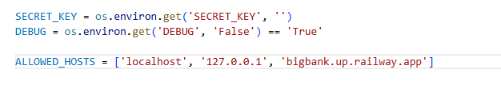
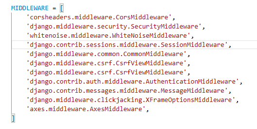
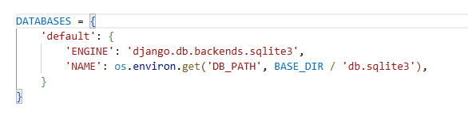
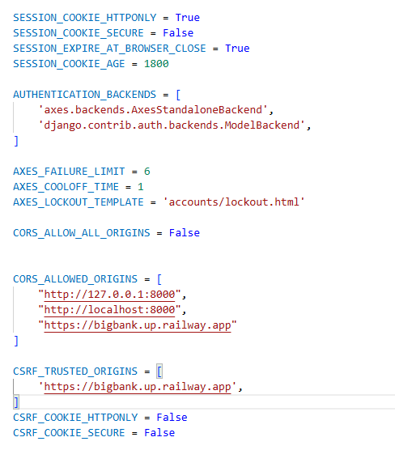

##### 2.1.2 Analisis HTTP Headers

**Tool:** Browser DevTools

| Header | Nilai | Keterangan |
|--------|-------|------------|
| Server | railway-edge | Terekspos, diketahui pakai Railway |
| X-Frame-Options | DENY | Aman, dapat mencegah clickjacking |
| X-Content-Type-Options | nosniff | Aman, dapat mencegah MIME sniffing |
| Content-Security-Policy | Tidak ada | Tidak dikonfigurasi |
| Set-Cookie | csrftoken=3q4xxy5OaxrOZV0dJMLf9m7Yj8PGnayo; expires=Sun, 23 May 2027 06:38:49 GMT; Max-Age=31449600; Path=/; SameSite=Lax | Tidak ada flag Secure dan HttpOnly |

> Screenshot: 
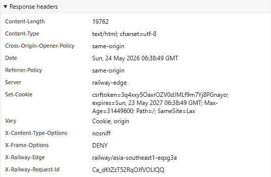

##### 2.1.3 Analisis Domain

**Tool:** Terminal (WSL) + whois.com (online)  
**Command yang dijalankan:**
```bash
# WHOIS lookup
whois bigbank.up.railway.app

# DNS lookup
nslookup bigbank.up.railway.app
dig bigbank.up.railway.app

# Cek IP address Railway
host bigbank.up.railway.app
```

**Hasil:**
| Informasi | Detail |
|-----------|--------|
| IP Address Publik | 66.33.22.91 |
| DNS Record Type | A Record |
| DNS TTL | 53 detik |
| Hosting Provider | Railway (railway-edge) |
| DNS Server | 10.255.255.254 |

**Screenshot:**
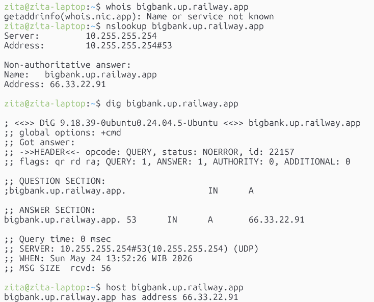

**WHOIS (via whois.com):**
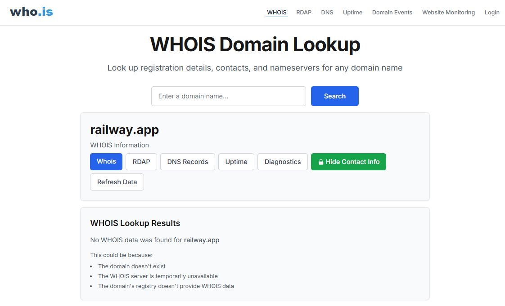

##### 2.1.4 Google Dorking

**Tool:** google.com
**Keyword yang dicari:**
site:railway.app "bigbank"
site:github.com "bigbank" "SECRET_KEY"
site:github.com "bigbank" "DATABASE_URL"
site:github.com "bigbank" ".env"

**Hasil:** Tidak ditemukan exposure pada repository milik kami.
Hasil yang muncul merupakan repository pihak lain yang tidak berkaitan.
**Status:** Aman, tidak ada credential/env file yang terekspos secara publik.

**Screenshot pencarian:**
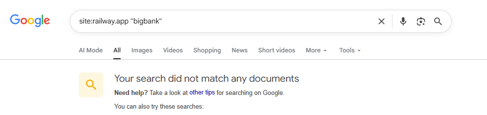
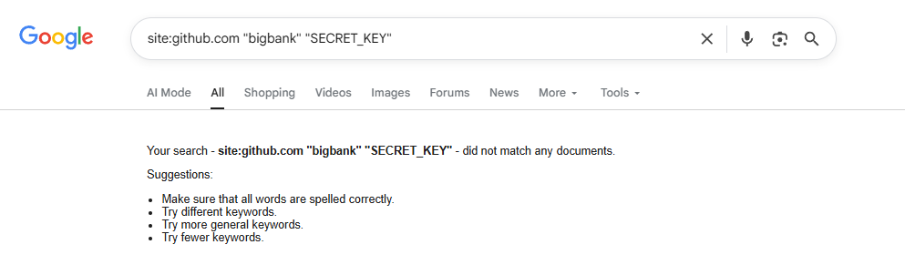
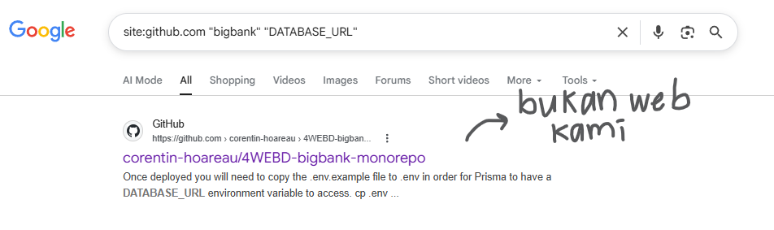
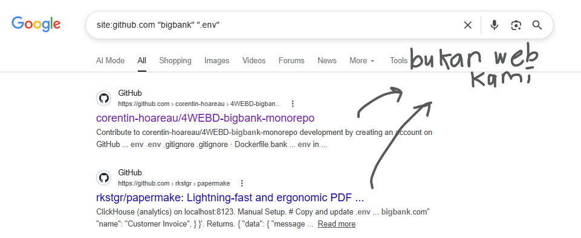


---

#### 2.2 Active Reconnaissance

##### 2.2.1 Network Scanning dengan nmap

**Tool:** nmap  
**Command yang dijalankan:**
```bash
# Mendapatkan IP 
host bigbank.up.railway.app
# atau
nslookup bigbank.up.railway.app
# Mencatat IP-nya

# Scan port yang terbuka
nmap -sV 66.33.22.91

# Scan port HTTP/HTTPS spesifik
nmap -sV -p 80,443,8000 66.33.22.91

# Scan dengan script detection
nmap -A 66.33.22.91
```

**Output nmap:**
```
zita@zita-laptop:~$ host bigbank.up.railway.app
bigbank.up.railway.app has address 66.33.22.91
zita@zita-laptop:~$ nmap -sV 66.33.22.91
Starting Nmap 7.95 ( https://nmap.org ) at 2026-05-24 14:12 WIB
Nmap scan report for 66.33.22.91
Host is up (0.027s latency).
Not shown: 825 filtered tcp ports (no-response)
PORT      STATE SERVICE    VERSION
21/tcp    open  ftp?
22/tcp    open  ssh        Golang x/crypto/ssh server (protocol 2.0)
80/tcp    open  http       Golang net/http server
443/tcp   open  ssl/https
554/tcp   open  rtsp?
1723/tcp  open  pptp?
...
zita@zita-laptop:~$ nmap -sV -p 80,443,8000 66.33.22.91
Starting Nmap 7.95 ( https://nmap.org ) at 2026-05-24 14:17 WIB
Nmap scan report for 66.33.22.91
Host is up (0.022s latency).

PORT     STATE    SERVICE   VERSION
80/tcp   open     http      Golang net/http server
443/tcp  open     ssl/https
8000/tcp filtered http-alt
...
zita@zita-laptop:~$ nmap -A 66.33.22.91
Starting Nmap 7.95 ( https://nmap.org ) at 2026-05-24 14:20 WIB
Nmap scan report for 66.33.22.91
Host is up (0.028s latency).
Not shown: 825 filtered tcp ports (no-response)
PORT      STATE SERVICE    VERSION
21/tcp    open  ftp?
22/tcp    open  ssh        Golang x/crypto/ssh server (protocol 2.0)
80/tcp    open  http       Golang net/http server
|_http-server-header: railway-edge
| fingerprint-strings:
|   DNSVersionBindReqTCP, GenericLines, Help, RPCCheck, RTSPRequest, SSLSessionReq:
|     HTTP/1.1 400 Bad Request
|     Content-Type: text/plain; charset=utf-8
|     Connection: close
|     Request
|   FourOhFourRequest:
|     HTTP/1.0 301 Moved Permanently
|     Content-Type: text/html; charset=utf-8
|     Location: https:///nice%20ports%2C/Tri%6Eity.txt%2ebak
|     Server: railway-edge
|     X-Railway-Edge: railway/asia-southeast1-eqsg3a
|     X-Railway-Request-Id: 5vPhfKpmQDqN54PZVOLIQQ
|     Date: Sun, 24 May 2026 07:21:09 GMT
|     Content-Length: 79
|     href="https:///nice%20ports%2C/Tri%6Eity.txt%2ebak">Moved Permanently</a>.
|   GetRequest:
|     HTTP/1.0 301 Moved Permanently
|     Content-Type: text/html; charset=utf-8
|     Location: https:///
|     Server: railway-edge
|     X-Railway-Edge: railway/asia-southeast1-eqsg3a
|     X-Railway-Request-Id: 1NNz9eqMQku1er-_AQeqjw
|     Date: Sun, 24 May 2026 07:21:08 GMT
|     Content-Length: 44
|     href="https:///">Moved Permanently</a>.
|   HTTPOptions:
|     HTTP/1.0 301 Moved Permanently
|     Location: https:///
|     Server: railway-edge
|     X-Railway-Edge: railway/asia-southeast1-eqsg3a
|     X-Railway-Request-Id: EJE8dDIpTa2y5sC_DcO5xA
|     Date: Sun, 24 May 2026 07:21:08 GMT
|_    Content-Length: 0
|_http-title: Did not follow redirect to https://66.33.22.91/
...
```

**Temuan nmap:**
| Port | State | Service | Version |
|------|-------|---------|---------|
| 21/tcp | open | ftp | - |
| 22/tcp | open | ssh | Golang x/crypto/ssh server (protocol 2.0) |
| 80/tcp | open | http | Golang net/http server (railway-edge) |
| 443/tcp | open | ssl/https | - |
| 554/tcp | open | rtsp | - |
| 1723/tcp | open | pptp | - |
| 8000/tcp | filtered | http-alt | - |

**Catatan:** Port 21 (FTP), 22 (SSH), 554 (RTSP), 1723 (PPTP) adalah milik infrastruktur Railway, bukan aplikasi BigBank. Port 8000 (Django dev server) dalam kondisi filtered dan tidak terekspos ke publik.

> Screenshot:
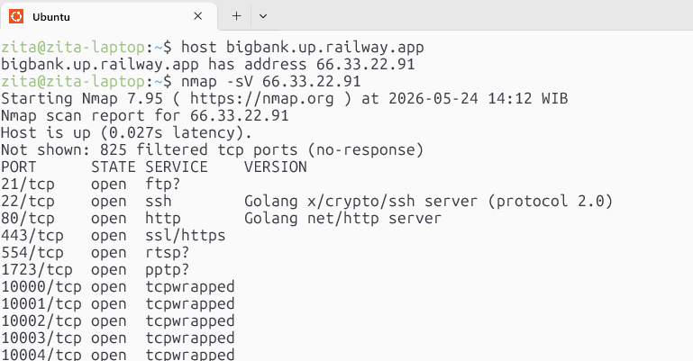
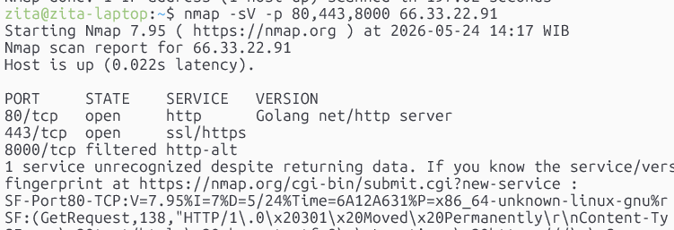
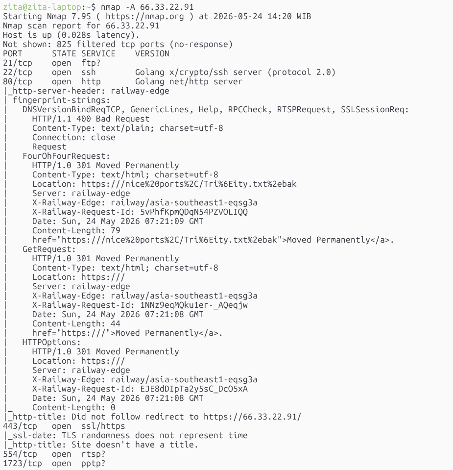

---

##### 2.2.2 Web Crawling dengan OWASP ZAP

**Tool:** OWASP ZAP  
**Teknik:** Spider + Passive Scanning

**Daftar Endpoint yang Ditemukan Spider ZAP:**

| No | URL | Method | Ditemukan Oleh |
|----|-----|--------|----------------|
| 1 | https://bigbank.up.railway.app | GET | Spider |
| 2 | https://bigbank.up.railway.app/robots.txt | GET | Spider |
| 3 | https://bigbank.up.railway.app/sitemap.xml | GET | Spider |
| 4 | https://bigbank.up.railway.app/accounts/login/ | GET | Spider |
| 5 | https://bigbank.up.railway.app/accounts/register/ | GET | Spider |
| 6 | https://bigbank.up.railway.app/accounts/login/ | POST | Spider |
| 7 | https://bigbank.up.railway.app/accounts/register/ | POST | Spider |
| 8 | https://bigbank.up.railway.app/accounts/dashboard/ | GET | Spider |
| 9 | https://bigbank.up.railway.app/accounts/profil/ | GET | Spider |
| 10 | https://bigbank.up.railway.app/banking/notifikasi/ | GET | Spider |
| 11 | https://bigbank.up.railway.app/banking/transfer/ | GET | Spider |
| 12 | https://bigbank.up.railway.app/banking/topup/ | GET | Spider |
| 13 | https://bigbank.up.railway.app/banking/mutasi/ | GET | Spider |
| 14 | https://bigbank.up.railway.app/banking/riwayat-topup/ | GET | Spider |
| 15 | https://bigbank.up.railway.app/accounts/logout/ | POST | Spider |

> Screenshot Hasil Automated Scan ZAP:
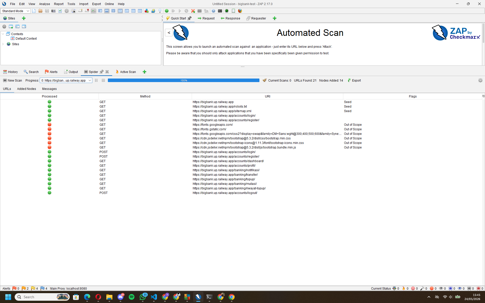
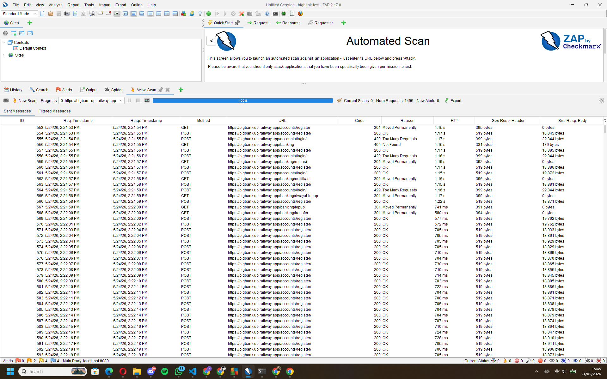

---

### 3. Threat Modeling

#### Tujuan
Mengidentifikasi high-value targets, attack surfaces, dan memetakan potensi ancaman.

#### 3.1 Identifikasi High-Value Targets

| No | Target | Deskripsi | Prioritas |
|----|--------|-----------|-----------|
| 1 | Halaman Login (`/accounts/login/`) | Pintu masuk utama ke seluruh sistem. Jika berhasil diretas, pelaku dapat menguasai akun nasabah, teller, hingga supervisor, dan menjalankan seluruh transaksi perbankan seolah-olah sebagai mereka. | High |
| 2 | Data Kredensial User (username dan password) | Data tersimpan dalam database SQLite (db.sqlite3). Jika terjadi kebocoran, informasi tersebut dapat dipakai untuk masuk langsung ke akun mana pun. Lalu, password yang tidak di-hash dengan benar berpotensi dieksploitasi secara massal. | High |
| 3 | Fitur Transfer & Top-Up (`/banking/transfer/`, `/banking/topup/`) | Fitur utama yang mengatur perpindahan dana antar rekening. Gangguan atau manipulasi pada endpoint ini berpotensi merugikan nasabah secara finansial secara langsung. | High |
| 4 | File Database (db.sqlite3) | Tempat penyimpanan seluruh data aplikasi, mulai dari data user, saldo, hingga riwayat transaksi. Karena SQLite merupakan file tunggal (single-file), akses atau download file itu sudah cukup untuk mendapat semua data sekaligus. | High |
| 5 | `settings.py` (SECRET_KEY, konfigurasi) | SECRET_KEY Django berfungsi untuk menandatangani session, token CSRF, dan keperluan kriptografi internal. Jika terekspos, penyerang dapat memalsukan session serta cookie pengguna. Selain itu, mode DEBUG yang menyala di lingkungan dev dapat membocorkan informasi stack trace saat terjadi error. | High |
| 6 | Session Token (cookie sessionid) | Cookie session yang diberikan setelah pengguna berhasil login. Jika cookie ini dicuri (melalui serangan XSS atau penyadapan jaringan), penyerang dapat mengambil alih active session tanpa perlu mengetahui password korban. | Medium |
| 7 | CSRF Token (cookie csrftoken) | Hasil analisis terhadap HTTP headers menunjukkan bahwa cookie csrftoken tidak dilengkapi flag Secure maupun HttpOnly. Akibatnya, token ini rentan terbaca oleh JavaScript (misalnya saat terjadi serangan XSS) dan juga dapat dikirim melalui koneksi yang tidak menggunakan HTTPS. | Medium |

#### 3.2 Identifikasi Attack Surface

| No | Entry Point | Deskripsi | Method |
|----|-------------|-----------|--------|
| 1 | Form Login (/accounts/login/) | Menerima input username dan password. Rentan terhadap SQL Injection jika penggunaan ORM tidak benar, brute force meskipun terdapat pemblokiran setelah 6 kali percobaan gagal via AXES, serta credential stuffing. | POST |
| 2 | Form Register (/accounts/register/) | Menerima input data nasabah baru. Berpotensi menjadi jalur masuk untuk stored XSS jika field nama tidak disanitasi, atau untuk pembuatan akun massal yang memudahkan enumerasi akun. Hasil scan ZAP mencatat respons 429 Too Many Requests, mengindikasikan adanya rate limiting. | POST |
| 3 | Form Transfer (/banking/transfer/) | Menerima input nomor rekening tujuan dan jumlah uang. Sebagai endpoint kritis, fitur ini rentan terhadap CSRF jika proteksi tidak diterapkan dengan benar, serta rentan terhadap tampering jika validasi di sisi server lemah. | POST |
| 4 | Form Top-Up (/banking/topup/) | Menerima input nominal pengisian saldo. Sama seperti fitur transfer, endpoint ini menjadi target serangan CSRF dan memerlukan validasi ketat di sisi server untuk mencegah manipulasi nilai nominal. | POST |
| 5 | URL Endpoint Terautentikasi (/accounts/dashboard/, /accounts/profil/, /banking/mutasi/, /banking/notifikasi/, /banking/riwayat-topup/) | Halaman yang seharusnya hanya bisa diakses setelah login. Rentan terhadap Broken Authentication jika dekorator login_required tidak diterapkan secara konsisten di seluruh view. | GET |
| 6 | Cookie (sessionid, csrftoken) | Cookie session tanpa flag Secure berpotensi dikirim melalui koneksi HTTP. Sementara itu, CSRF token tanpa flag HttpOnly dapat dibaca oleh JavaScript, yang berbahaya jika terdapat celah XSS. | - |
| 7 | Admin Panel Django (/admin/) | Panel administrasi bawaan Django. Jika tidak dinonaktifkan atau dibatasi aksesnya, panel ini dapat menjadi sasaran serangan brute force dan peningkatan hak akses (privilege escalation). | GET/POST |
| 8 | robots.txt dan sitemap.xml | Ditemukan oleh ZAP Spider sebagai Seed. Keberadaan file ini dapat memberikan informasi struktur URL aplikasi kepada penyerang, sehingga mempermudah pemetaan area serangan (attack surface). | GET |

#### 3.3 Threat Modeling — STRIDE

| Threat | Definisi | Contoh pada Aplikasi | Target Aset | Likelihood | Impact | Priority |
|--------|----------|----------------------|-------------|------------|--------|----------|
| Spoofing | Menyamar sebagai pengguna lain | Penyerang menggunakan kredensial yang dicuri (melalui phishing atau credential stuffing) untuk login ke halaman /accounts/login/ seolah-olah sebagai nasabah lain, lalu melakukan transfer atas nama korban. Bisa terjadi juga jika token sesi berhasil dicuri dan digunakan untuk pencurian sesi. | Kredensial pengguna, Token sesi (sessionid) | Medium | High | High |
| Tampering | Memodifikasi data | Penyerang memanipulasi parameter POST pada halaman /banking/transfer/ (misalnya mengubah nilai jumlah atau nomor rekening tujuan) untuk mengalihkan dana ke rekening lain atau dengan nominal berbeda. Serangan juga dapat dilakukan melalui SQL Injection untuk mengubah data saldo secara langsung di database. | Data transaksi (saldo, riwayat transfer, top-up), Basis data db.sqlite3 | Medium | High | High |
| Repudiation | Menyangkal aksi yang telah dilakukan | Pengguna dapat menyangkal telah melakukan transfer jika tidak ada mekanisme audit log yang kuat dan tidak ditampilkan kepada pengguna. Apabila tabel riwayat transaksi dapat dimanipulasi melalui SQL Injection atau tidak mencatat metadata seperti alamat IP, waktu, dan agen pengguna, penyerang dapat menghapus jejak aktivitasnya. | Log transaksi, Riwayat mutasi (/banking/mutasi/, /banking/riwayat-topup/) | Low | Medium | Medium |
| Information Disclosure | Bocornya informasi sensitif | Skenario kebocoran informasi misalnya adalah token CSRF tidak dilengkapi flag HttpOnly sehingga dapat dibaca oleh JavaScript. Lalu, header Server  railway-edge mengekspos infrastruktur hosting yang digunakan. Lalu, jika mode DEBUG=True aktif di lingkungan production, Django akan menampilkan stack trace lengkap (termasuk jalur file, variabel, dan konfigurasi) saat terjadi error, serta file db.sqlite3 mungkin terekspos jika konfigurasi penyajian file statis tidak tepat. | Token CSRF, Konfigurasi server, Stack trace Django, Data basis data | Medium | High | High |
| Denial of Service | Melumpuhkan layanan | Penyerang mengirimkan permintaan POST berulang kali ke halaman /accounts/register/ secara otomatis untuk menghabiskan sumber daya server (ZAP telah memicu respons 429 pada endpoint ini selama pemindaian otomatis dengan 1495 permintaan). Selain itu, serangan brute force ke halaman /accounts/login/ meskipun terdapat pemblokiran akun dari AXES, dapat menyebabkan penguncian massal akun pengguna yang sah. | Server aplikasi, Akun pengguna (penguncian akun), Endpoint /accounts/register/, /accounts/login/ | Medium | Medium | Medium |
| Elevation of Privilege | Mendapatkan hak akses yang lebih tinggi dari yang seharusnya | Pengguna dengan peran nasabah mencoba mengakses URL yang seharusnya hanya untuk peran teller (misalnya fitur kelola rekening, proses top-up, atau proses transfer dari teller) atau peran supervisor (laporan, kelola pengguna) dengan mengetikkan URL secara langsung di peramban. Jika pemeriksaan izin akses (dekorator permission) tidak diterapkan pada semua halaman, akses ilegal dapat berhasil dilakukan. | Halaman dashboard teller atau supervisor, Fitur kelola pengguna, laporan, proses top-up, proses transfer, Panel admin /admin/ | Medium | High | High |

#### 3.4 Pemetaan ke Kategori Uji

| Kategori Uji | Threat STRIDE | Endpoint Target |
|--------------|---------------|-----------------|
| SQL Injection | Tampering, Information Disclosure | `/accounts/login/` (field username/password) |
| Code Injection / XSS | Tampering, Information Disclosure | `/accounts/register/` (field nama/username), `/accounts/profil/`, `/banking/notifikasi/` |
| CSRF | Tampering, Spoofing | `/banking/transfer/`, `/banking/topup/`, `/accounts/logout/` |
| Broken Authentication | Spoofing, Elevation of Privilege | `/accounts/login/`, `/accounts/dashboard/`, dan endpoint role-restricted (teller/supervisor) |
---

### 4. Scanning & Enumeration

#### Tujuan
Mendeteksi kerentanan secara otomatis dan manual.

#### 4.1 Automated Scanning dengan OWASP ZAP

**Tool:** OWASP ZAP Active Scan  
**Teknik:** Active Scanning (SQLi, XSS, CSRF detection)

**Temuan ZAP Alerts:**
| No | Alert Name | Risk Level | Confidence | Endpoint | Parameter |
|----|-----------|------------|------------|----------|-----------|
| 1 | Content Security Policy (CSP) Header Not Set | Medium | High | https://bigbank.up.railway.app | - |
| 2 | Sub Resource Integrity Attribute Missing | Medium | High | https://bigbank.up.railway.app | - |
| 3 | Cookie No HttpOnly Flag | Low | Medium | https://bigbank.up.railway.app | csrftoken |
| 4 | Cookie Without Secure Flag | Low | Medium | https://bigbank.up.railway.app | csrftoken |
| 5 | Cross-Domain JavaScript Source File Inclusion | Low | Medium | https://bigbank.up.railway.app | - |
| 6 | Strict-Transport-Security Header Not Set | Low | High | https://bigbank.up.railway.app | - |
| 7 | Authentication Request Identified | Informational | High | https://bigbank.up.railway.app/accounts/login/ | username |
| 8 | Re-examine Cache-control Directives | Informational | Low | https://bigbank.up.railway.app | cache-control |
| 9 | Session Management Response Identified | Informational | Medium | https://bigbank.up.railway.app | csrftoken |
| 10 | User Controllable HTML Element Attribute (Potential XSS) | Informational | Low | https://bigbank.up.railway.app/accounts/login/ | password |

> Screenshot (Tab Alerts ZAP): 
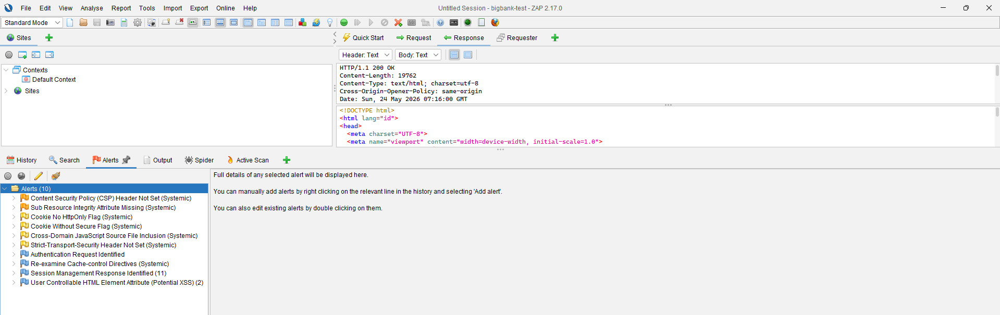
> Screenshot (Detail salah satu alert):
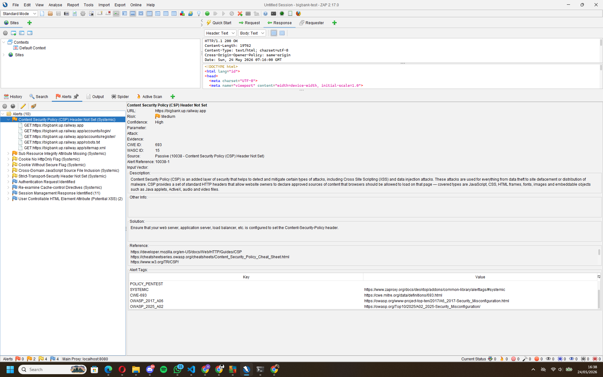

---

#### 4.2 Manual Scanning — SQL Injection

**Tool:** Manual browser + sqlmap  
**Endpoint yang diuji:** `https://bigbank.up.railway.app/accounts/login/`

**Payload yang dicoba:**
'
''
' OR '1'='1
' OR '1'='1' --
' OR '1'='1' /*
admin'--
' OR 1=1--
1' ORDER BY 1--
1' ORDER BY 2--
1' UNION SELECT null--
1' UNION SELECT null,null--

**Temuan:**

| No | Endpoint | Parameter | Payload | Response | Status |
|----|----------|-----------|---------|----------|--------|
| 1 | /accounts/login/ | username | `'` | HTTP 200 : "Input mengandung karakter yang tidak diizinkan" (client-side validation) | Protected (client-side) |
| 2 | /accounts/login/ | username | `''` | HTTP 200 : "Input mengandung karakter yang tidak diizinkan" (client-side validation) | Protected (client-side) |
| 3 | /accounts/login/ | username | `' OR '1'='1` | HTTP 200 : "Input mengandung karakter yang tidak diizinkan" (client-side validation) | Protected (client-side) |
| 4 | /accounts/login/ | username | `' OR '1'='1' --` | HTTP 200 : "Input mengandung karakter yang tidak diizinkan" (client-side validation) | Protected (client-side) |
| 5 | /accounts/login/ | username | `' OR '1'='1' /*` | HTTP 200 : "Input mengandung karakter yang tidak diizinkan" (client-side validation) | Protected (client-side) |
| 6 | /accounts/login/ | username | `admin'--` | HTTP 200 : "Input mengandung karakter yang tidak diizinkan" (client-side validation) | Protected (client-side) |
| 7 | /accounts/login/ | username | `' OR 1=1--` | HTTP 200 : "Input mengandung karakter yang tidak diizinkan" (client-side validation) | Protected (client-side) |
| 8 | /accounts/login/ | username | `1' ORDER BY 1--` | HTTP 200 : "Input mengandung karakter yang tidak diizinkan" (client-side validation) | Protected (client-side) |
| 9 | /accounts/login/ | username | `1' ORDER BY 2--` | HTTP 200 : "Input mengandung karakter yang tidak diizinkan" (client-side validation) | Protected (client-side) |
| 10 | /accounts/login/ | username | `1' UNION SELECT null--` | HTTP 200 : "Input mengandung karakter yang tidak diizinkan" (client-side validation) | Protected (client-side) |
| 11 | /accounts/login/ | username | `1' UNION SELECT null,null--` | HTTP 200 : "Input mengandung karakter yang tidak diizinkan" (client-side validation) | Protected (client-side) |
Catatan: Semua payload dimasukkan di field username. Field password diisi dengan nilai dummy (`test`) agar form dapat di-submit.

> Screenshot: 
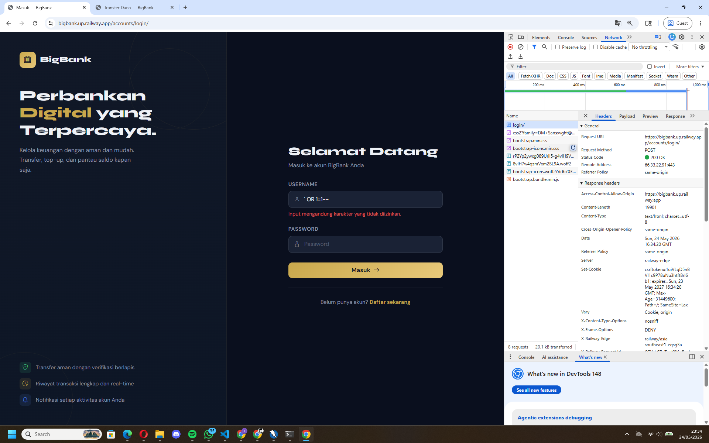
(sisanya sama seperti ini)

**Hasil sqlmap:**
| No | Endpoint | Parameter | Payload | Response | Status |
|----|----------|-----------|---------|----------|--------|
| 1 | /accounts/login/ | username | SQLmap automated payloads (boolean-based blind, UNION, inline) | HTTP 200 — tidak ada injeksi terdeteksi, 429 Too Many Requests (rate limiting aktif) | Protected |
| 2 | /accounts/login/ | password | SQLmap automated payloads (boolean-based blind) | False positive — tidak exploitable | Protected |

**Output sqlmap:**
```
zita@zita-laptop:~$ sqlmap -u "https://bigbank.up.railway.app/accounts/login/" --data="username=admin&password=test&csrfmiddlewaretoken=K0Z5UxupZSWww8P4NMemhTOg49kCof9y" --cookie="csrftoken=K0Z5UxupZSWww8P4NMemhTOg49kCof9y" --method=POST --level=3 --risk=2 --batch --dbs
        ___
       __H__
 ___ ___[,]_____ ___ ___  {1.8.12#pip}
|_ -| . [.]     | .'| . |
|___|_  ["]_|_|_|__,|  _|
      |_|V...       |_|   https://sqlmap.org

[!] legal disclaimer: Usage of sqlmap for attacking targets without prior mutual consent is illegal. It is the end user's responsibility to obey all applicable local, state and federal laws. Developers assume no liability and are not responsible for any misuse or damage caused by this program

[*] starting @ 17:05:09 /2026-05-24/

POST parameter 'csrfmiddlewaretoken' appears to hold anti-CSRF token. Do you want sqlmap to automatically update it in further requests? [y/N] N
Cookie parameter 'csrftoken' appears to hold anti-CSRF token. Do you want sqlmap to automatically update it in further requests? [y/N] N
[17:05:09] [INFO] testing connection to the target URL
[17:05:10] [INFO] checking if the target is protected by some kind of WAF/IPS
you provided a HTTP Cookie header value, while target URL provides its own cookies within HTTP Set-Cookie header which intersect with yours. Do you want to merge them in further requests? [Y/n] Y
[17:05:12] [INFO] testing if the target URL content is stable
[17:05:13] [WARNING] target URL content is not stable (i.e. content differs). sqlmap will base the page comparison on a sequence matcher. If no dynamic nor injectable parameters are detected, or in case of junk results, refer to user's manual paragraph 'Page comparison'
how do you want to proceed? [(C)ontinue/(s)tring/(r)egex/(q)uit] C
[17:05:13] [INFO] testing if POST parameter 'username' is dynamic
[17:05:14] [WARNING] POST parameter 'username' does not appear to be dynamic
[17:05:16] [WARNING] heuristic (basic) test shows that POST parameter 'username' might not be injectable
[17:05:17] [INFO] testing for SQL injection on POST parameter 'username'
[17:05:17] [INFO] testing 'AND boolean-based blind - WHERE or HAVING clause'
[17:05:18] [WARNING] reflective value(s) found and filtering out
[17:06:19] [INFO] testing 'AND boolean-based blind - WHERE or HAVING clause (subquery - comment)'
[17:06:52] [INFO] testing 'AND boolean-based blind - WHERE or HAVING clause (comment)'
[17:07:18] [INFO] testing 'AND boolean-based blind - WHERE or HAVING clause (MySQL comment)'
[17:07:51] [INFO] testing 'AND boolean-based blind - WHERE or HAVING clause (Microsoft Access comment)'
[17:08:24] [INFO] POST parameter 'username' appears to be 'AND boolean-based blind - WHERE or HAVING clause (Microsoft Access comment)' injectable
it looks like the back-end DBMS is 'Microsoft Access'. Do you want to skip test payloads specific for other DBMSes? [Y/n] Y
for the remaining tests, do you want to include all tests for 'Microsoft Access' extending provided level (3) and risk (2) values? [Y/n] Y
[17:08:24] [INFO] testing 'Generic inline queries'
[17:08:24] [INFO] testing 'Generic UNION query (NULL) - 1 to 20 columns'
[17:08:24] [INFO] automatically extending ranges for UNION query injection technique tests as there is at least one other (potential) technique found
[17:08:47] [INFO] target URL appears to be UNION injectable with 16 columns
injection not exploitable with NULL values. Do you want to try with a random integer value for option '--union-char'? [Y/n] Y
[17:11:07] [WARNING] if UNION based SQL injection is not detected, please consider forcing the back-end DBMS (e.g. '--dbms=mysql')
[17:11:07] [INFO] testing 'Generic UNION query (72) - 21 to 40 columns'
[17:11:24] [INFO] testing 'Generic UNION query (72) - 41 to 60 columns'
[17:11:44] [INFO] checking if the injection point on POST parameter 'username' is a false positive
[17:11:47] [WARNING] false positive or unexploitable injection point detected
[17:11:47] [WARNING] POST parameter 'username' does not seem to be injectable
[17:11:47] [INFO] testing if POST parameter 'password' is dynamic
[17:11:48] [WARNING] POST parameter 'password' does not appear to be dynamic
[17:11:49] [WARNING] heuristic (basic) test shows that POST parameter 'password' might not be injectable
[17:11:50] [INFO] testing for SQL injection on POST parameter 'password'
[17:11:50] [INFO] testing 'AND boolean-based blind - WHERE or HAVING clause'
[17:11:52] [INFO] POST parameter 'password' appears to be 'AND boolean-based blind - WHERE or HAVING clause' injectable
[17:11:52] [INFO] testing 'Generic inline queries'
[17:11:53] [INFO] testing 'Generic UNION query (72) - 1 to 20 columns'
[17:12:13] [INFO] testing 'Generic UNION query (72) - 21 to 40 columns'
[17:12:30] [INFO] testing 'Generic UNION query (72) - 41 to 60 columns'
[17:12:49] [INFO] checking if the injection point on POST parameter 'password' is a false positive
[17:12:50] [WARNING] false positive or unexploitable injection point detected
[17:12:50] [WARNING] POST parameter 'password' does not seem to be injectable
[17:12:50] [INFO] ignoring POST parameter 'csrfmiddlewaretoken'
[17:12:50] [INFO] ignoring Cookie parameter 'csrftoken'
[17:12:50] [INFO] testing if parameter 'User-Agent' is dynamic
[17:12:51] [WARNING] parameter 'User-Agent' does not appear to be dynamic
[17:12:51] [WARNING] heuristic (basic) test shows that parameter 'User-Agent' might not be injectable
[17:12:52] [INFO] testing for SQL injection on parameter 'User-Agent'
[17:12:52] [INFO] testing 'AND boolean-based blind - WHERE or HAVING clause'
[17:13:32] [INFO] testing 'AND boolean-based blind - WHERE or HAVING clause (subquery - comment)'
[17:13:54] [INFO] testing 'AND boolean-based blind - WHERE or HAVING clause (comment)'
[17:14:17] [INFO] testing 'Boolean-based blind - Parameter replace (original value)'
[17:14:19] [INFO] testing 'Boolean-based blind - Parameter replace (DUAL)'
[17:14:21] [INFO] testing 'Boolean-based blind - Parameter replace (DUAL - original value)'
[17:14:23] [INFO] testing 'Boolean-based blind - Parameter replace (CASE)'
[17:14:24] [INFO] testing 'Boolean-based blind - Parameter replace (CASE - original value)'
[17:14:26] [INFO] testing 'HAVING boolean-based blind - WHERE, GROUP BY clause'
[17:15:06] [INFO] testing 'Generic inline queries'
it is recommended to perform only basic UNION tests if there is not at least one other (potential) technique found. Do you want to reduce the number of requests? [Y/n] Y
[17:15:07] [INFO] testing 'Generic UNION query (72) - 1 to 10 columns'
[17:15:29] [WARNING] parameter 'User-Agent' does not seem to be injectable
[17:15:29] [INFO] testing if parameter 'Referer' is dynamic
[17:15:30] [WARNING] parameter 'Referer' does not appear to be dynamic
[17:15:31] [WARNING] heuristic (basic) test shows that parameter 'Referer' might not be injectable
[17:15:32] [INFO] testing for SQL injection on parameter 'Referer'
[17:15:32] [INFO] testing 'AND boolean-based blind - WHERE or HAVING clause'
[17:16:14] [INFO] testing 'AND boolean-based blind - WHERE or HAVING clause (subquery - comment)'
[17:16:37] [INFO] testing 'AND boolean-based blind - WHERE or HAVING clause (comment)'
[17:16:59] [INFO] testing 'Boolean-based blind - Parameter replace (original value)'
[17:17:01] [INFO] testing 'Boolean-based blind - Parameter replace (DUAL)'
[17:17:02] [INFO] testing 'Boolean-based blind - Parameter replace (DUAL - original value)'
[17:17:04] [INFO] testing 'Boolean-based blind - Parameter replace (CASE)'
[17:17:06] [INFO] testing 'Boolean-based blind - Parameter replace (CASE - original value)'
[17:17:08] [INFO] testing 'HAVING boolean-based blind - WHERE, GROUP BY clause'
[17:18:12] [INFO] testing 'Generic inline queries'
[17:18:13] [INFO] testing 'Generic UNION query (72) - 1 to 10 columns'
[17:18:31] [WARNING] parameter 'Referer' does not seem to be injectable
[17:18:31] [CRITICAL] all tested parameters do not appear to be injectable. Try to increase values for '--level'/'--risk' options if you wish to perform more tests. If you suspect that there is some kind of protection mechanism involved (e.g. WAF) maybe you could try to use option '--tamper' (e.g. '--tamper=space2comment') and/or switch '--random-agent'
[17:18:31] [WARNING] HTTP error codes detected during run:
429 (Too Many Requests) - 437 times
[17:18:31] [WARNING] your sqlmap version is outdated

[*] ending @ 17:18:31 /2026-05-24/
```

> Screenshot:
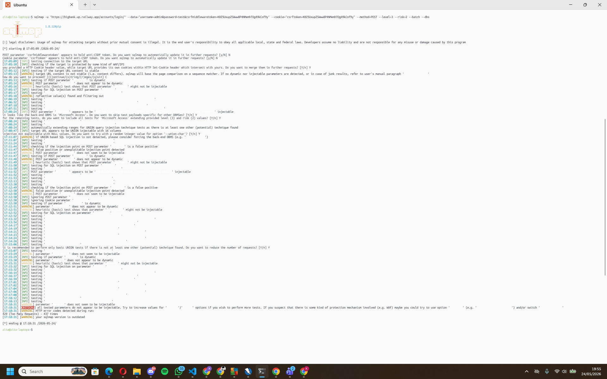

---

#### 4.3 Manual Scanning — Code Injection / XSS

**Tool:** Manual browser  
**Endpoint yang diuji:** [TODO]

**Payload yang dicoba:**
<script>alert('XSS')</script>
"><script>alert('XSS')</script>

<svg onload=alert('XSS')>
<SCRIPT>alert('XSS')</SCRIPT>
javascript:alert('XSS')
{{7*7}}

**Temuan:**

| No | Endpoint | Field | Payload | Hasil di Browser | HTML Source | Status |
|----|----------|-------|---------|-----------------|-------------|--------|
| 1 | /banking/transfer/ | keterangan | `{{7*7}}` | "Input mengandung karakter yang tidak diizinkan." — form tidak disubmit | Input diblokir client-side | Protected |
| 2 | /banking/transfer/ | keterangan | `<script>alert('XSS')</script>` | "Input mengandung karakter yang tidak diizinkan." — form tidak disubmit | Input diblokir client-side | Protected |
| 3 | /banking/transfer/ | keterangan | `"><script>alert('XSS')</script>` | "Input mengandung karakter yang tidak diizinkan." — form tidak disubmit | Input diblokir client-side | Protected |
| 4 | /banking/transfer/ | keterangan | `` | "Input mengandung karakter yang tidak diizinkan." — form tidak disubmit | Input diblokir client-side | Protected |
| 5 | /banking/transfer/ | keterangan | `<svg onload=alert('XSS')>` | "Input mengandung karakter yang tidak diizinkan." — form tidak disubmit | Input diblokir client-side | Protected |
| 6 | /banking/transfer/ | keterangan | `<SCRIPT>alert('XSS')</SCRIPT>` | "Input mengandung karakter yang tidak diizinkan." — form tidak disubmit | Input diblokir client-side | Protected |
| 7 | /banking/transfer/ | keterangan | `javascript:alert('XSS')` | "Input mengandung karakter yang tidak diizinkan." — form tidak disubmit | Input diblokir client-side | Protected |

> Screenshot: 
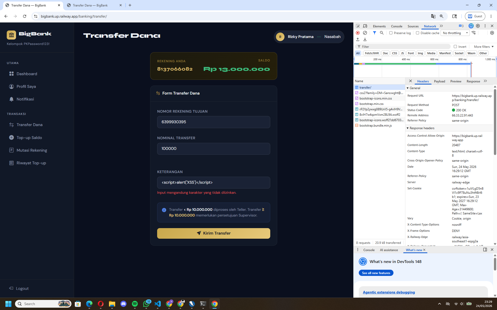


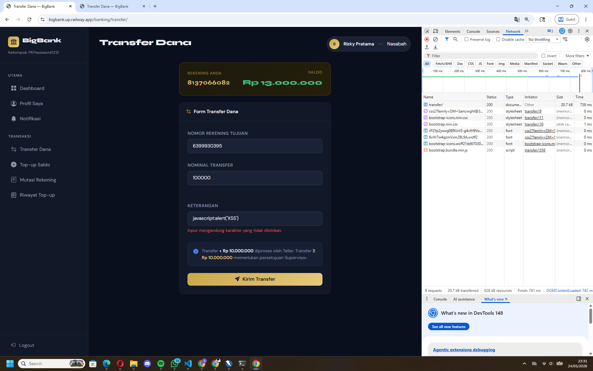
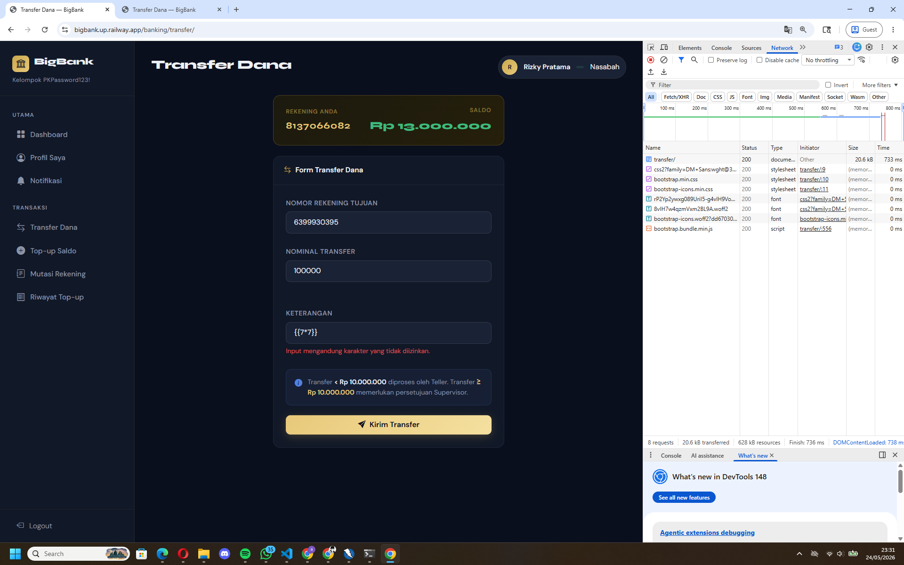

---

#### 4.4 Manual Scanning — Broken Authentication

**Tool:** Manual browser + Django shell

**Sub-pengujian:**

| No | Pengujian | Metode | Hasil | Status |
|----|-----------|--------|-------|--------|
| 1 | Akses URL tanpa login | Direct URL | Mengakses `/accounts/dashboard/` tanpa login lalu di-redirect ke `/accounts/login/?next=/accounts/dashboard/` (HTTP 302) | Protected |
| 2 | Password disimpan hashed | Django shell | `CustomUser.objects.first().password` mengembalikan hash `pbkdf2_sha256$600000$...` berarti password tidak disimpan plaintext | Protected |
| 3 | Session ID berubah setelah login | Cookie inspect | Session ID baru diterbitkan setelah login (`sessionid=xz75tc1sfcm...`), dan session lama dihapus setelah logout (`sessionid=9fe1q6he84...` di-clear) | Protected |
| 4 | Brute force login | Manual | Setelah 6 kali percobaan login gagal, akun terkunci sementara dengan pesan "Akun Sementara Terkunci" dan countdown timer 59:55 (HTTP 429) | Protected |
| 5 | Privilege escalation | Direct URL | User nasabah (Dewi Lestari) mencoba akses `/banking/antrian-transfer/` (halaman teller) → di-redirect ke dashboard dengan pesan "Anda tidak memiliki akses ke halaman ini." (HTTP 302) | Protected |

> Screenshot:

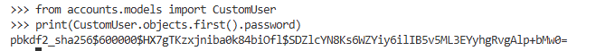
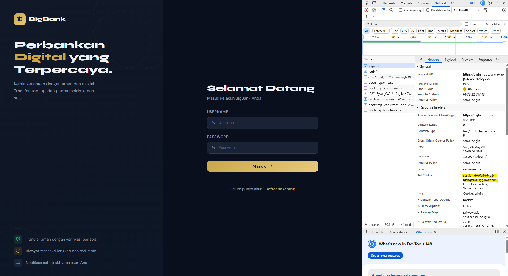
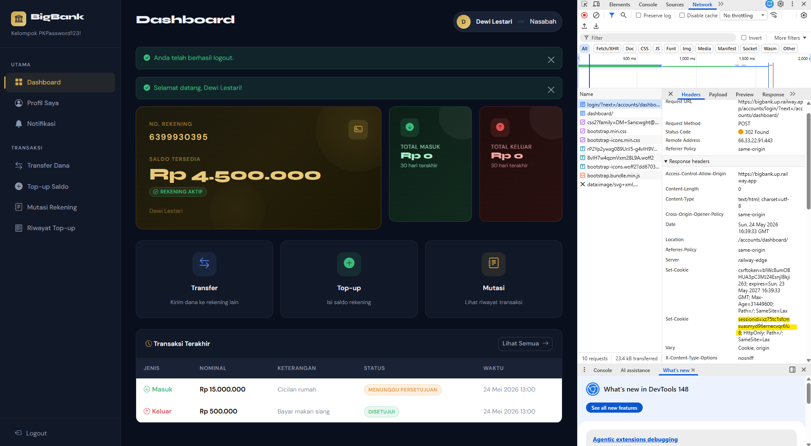
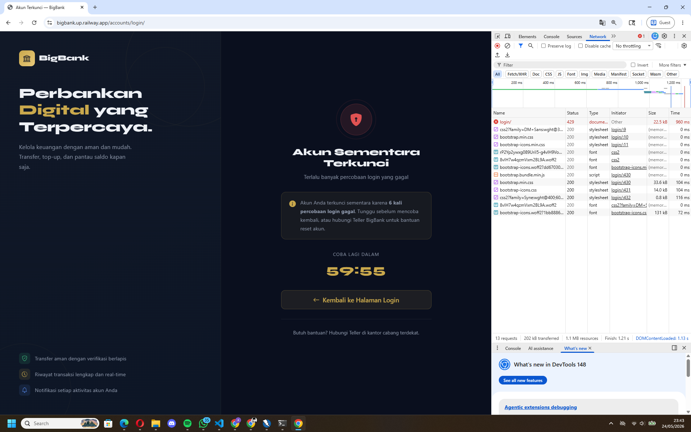
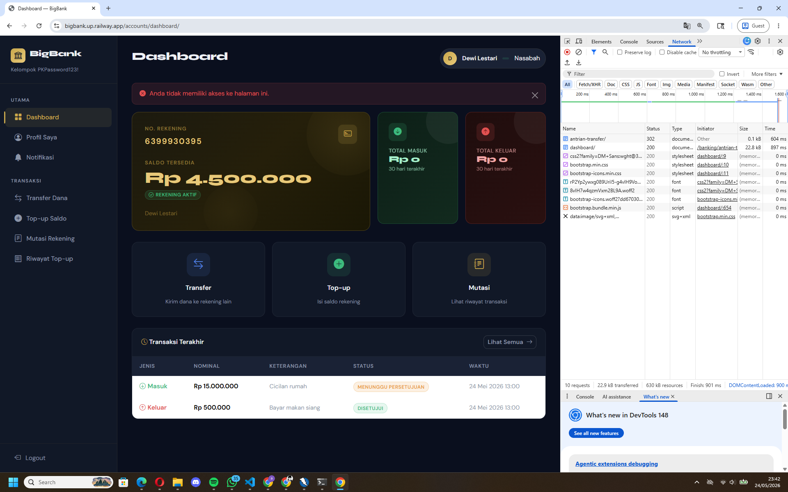

---

#### 4.5 Manual Scanning — CSRF

**Tool:** Manual (file HTML eksternal)

**Temuan:**

| No | Endpoint | Method | CSRF Token di Form | Hasil Serangan | Status |
|----|----------|--------|--------------------|----------------|--------|
| 1 | /banking/topup/ | POST | Ada — `<input type="hidden" name="csrfmiddlewaretoken" value="...">` | HTTP 403 Forbidden — "Verifikasi CSRF gagal, Permintaan dibatalkan." saat request dikirim tanpa token valid | Protected |
| 2 | /accounts/login/ | POST | Ada — `<input type="hidden" name="csrfmiddlewaretoken" value="wEtYbL9fAb0cRvP8dBJSkkLRTClghYKVG3vEYvLD7YJ7F0dSc8KFMLmwUKrAHWsu">` | CSRF token wajib ada di setiap request POST, request tanpa token ditolak server | Protected |

> Screenshot:

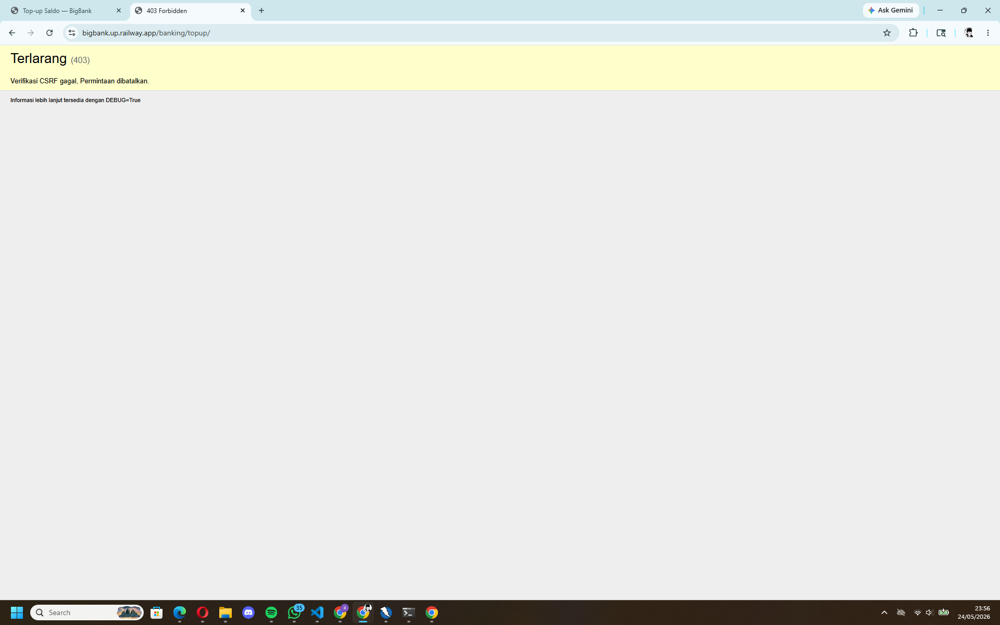

---

### 5. Exploitation & Testing

#### Tujuan
Membuktikan apakah kerentanan yang ditemukan dapat dieksploitasi.

---

#### Temuan #1 — SQL Injection

| | |
|-|-|
| **Reference No** | WEB_VUL_01 |
| **Kategori** | SQL Injection |
| **Risk Rating** | High |
| **Endpoint** | `/accounts/login/` |
| **Parameter** | `username`, `password` |
| **Tools Used** | Manual browser, sqlmap |

**Vulnerability Description:**
SQL Injection adalah serangan yang menyisipkan perintah SQL berbahaya ke dalam input pengguna untuk memanipulasi query database. Pada aplikasi BigBank, endpoint `/accounts/login/` diuji karena merupakan titik masuk utama yang memproses input username dan password.

**Vulnerability Identified by / How It Was Discovered:**
Ditemukan melalui pengujian manual dengan memasukkan karakter khusus SQL pada field username, dilanjutkan dengan automated testing menggunakan sqlmap level 3 risk 2.

**Vulnerable URLs:**
`https://bigbank.up.railway.app/accounts/login/`

**Langkah Eksploitasi:**
1. Buka `https://bigbank.up.railway.app/accounts/login/` di browser
2. Masukkan payload SQL (contoh: `' OR '1'='1`) pada field username, field password diisi `test`
3. Amati respons — apakah login berhasil bypass atau muncul SQL error
4. Jalankan sqlmap: `sqlmap -u "https://bigbank.up.railway.app/accounts/login/" --data="username=admin&password=test&csrfmiddlewaretoken=TOKEN" --cookie="csrftoken=TOKEN" --method=POST --level=3 --risk=2 --batch --dbs`

**Payload yang Digunakan:**
`'`, `''`, `' OR '1'='1`, `' OR '1'='1' --`, `admin'--`, `' OR 1=1--`, `1' UNION SELECT null--`

**Hasil / Proof of Concept:**
Semua payload manual diblokir oleh validasi client-side dengan pesan "Input mengandung karakter yang tidak diizinkan." Pengujian sqlmap juga tidak menemukan parameter yang dapat diinjeksi — semua deteksi awal terkonfirmasi sebagai false positive. Server juga aktif mengembalikan HTTP 429 Too Many Requests sebanyak 437 kali selama pengujian sqlmap, menandakan rate limiting berjalan.

**Implications / Consequences of not Fixing the Issue:**
Jika SQL Injection berhasil dieksploitasi, penyerang dapat bypass autentikasi login, membaca seluruh isi database (data nasabah, saldo, riwayat transaksi), dan berpotensi memodifikasi atau menghapus data.

**Suggested Countermeasures:**
- Django ORM secara default menggunakan parameterized queries — pastikan tidak ada penggunaan `raw()` atau `extra()` tanpa sanitasi
- Pertahankan validasi input yang sudah ada di client-side
- Tambahkan validasi server-side yang sama ketatnya agar tidak bergantung hanya pada client-side

**Status:** Protected

> Screenshot: 

---

#### Temuan #2 — XSS / Code Injection

| | |
|-|-|
| **Reference No** | WEB_VUL_02 |
| **Kategori** | Cross-Site Scripting (XSS) |
| **Risk Rating** | High |
| **Endpoint** | `/banking/transfer/` |
| **Parameter** | `keterangan` |
| **Tools Used** | Manual browser |

**Vulnerability Description:**
Cross-Site Scripting (XSS) adalah serangan yang menyisipkan skrip berbahaya ke dalam halaman web yang kemudian dieksekusi oleh browser pengguna lain. Pada aplikasi BigBank, field `keterangan` pada form transfer diuji karena nilainya berpotensi ditampilkan kembali di halaman riwayat transaksi.

**Vulnerability Identified by / How It Was Discovered:**
Ditemukan melalui pengujian manual dengan memasukkan berbagai payload XSS dan template injection pada field keterangan di `/banking/transfer/`, termasuk payload `<script>`, ``, `<svg>`, dan `{{7*7}}`.

**Vulnerable URLs:**
`https://bigbank.up.railway.app/banking/transfer/`

**Langkah Eksploitasi:**
1. Login sebagai nasabah, buka `https://bigbank.up.railway.app/banking/transfer/`
2. Isi field nomor rekening tujuan dan nominal transfer dengan nilai valid
3. Masukkan payload XSS pada field keterangan (contoh: `<script>alert('XSS')</script>`)
4. Klik "Kirim Transfer" dan amati respons browser
5. Cek apakah alert muncul atau payload tersimpan dan dirender di halaman riwayat

**Payload yang Digunakan:**
`{{7*7}}`, `<script>alert('XSS')</script>`, `"><script>alert('XSS')</script>`, ``, `<svg onload=alert('XSS')>`, `<SCRIPT>alert('XSS')</SCRIPT>`, `javascript:alert('XSS')`

**Hasil / Proof of Concept:**
Seluruh payload diblokir oleh validasi client-side dengan pesan "Input mengandung karakter yang tidak diizinkan." Form tidak dapat disubmit. Tidak ada alert yang muncul dan tidak ada payload yang terkirim ke server.

**Implications / Consequences:**
Jika XSS berhasil, penyerang dapat mencuri cookie session nasabah lain, melakukan aksi atas nama korban, atau menampilkan halaman phishing palsu dalam konteks aplikasi BigBank.

**Suggested Countermeasures:**
- Pertahankan validasi client-side yang sudah ada
- Pastikan Django template auto-escaping aktif (`{{ variable }}` bukan `{{ variable|safe }}`) untuk mencegah XSS di sisi server
- Tambahkan Content Security Policy (CSP) header — saat ini belum dikonfigurasi (ditemukan ZAP alert: CSP Header Not Set)

**Status:** Protected

> Screenshot:


---

#### Temuan #3 — CSRF

| | |
|-|-|
| **Reference No** | WEB_VUL_03 |
| **Kategori** | Cross-Site Request Forgery |
| **Risk Rating** | Medium |
| **Endpoint** | `/banking/topup/`, `/accounts/login/` |
| **Tools Used** | Manual browser |

**Vulnerability Description:**
CSRF adalah serangan yang memaksa pengguna yang sudah terautentikasi untuk mengirimkan request berbahaya tanpa sepengetahuannya. Penyerang membuat halaman HTML eksternal yang secara otomatis mengirimkan form POST ke endpoint target.

**Vulnerability Identified by / How It Was Discovered:**
Ditemukan melalui inspeksi HTML source form login dan pengujian langsung dengan mengirimkan POST request ke `/banking/topup/` tanpa menyertakan CSRF token yang valid.

**Langkah Eksploitasi:**
1. Buka HTML source `https://bigbank.up.railway.app/accounts/login/` — cari `csrfmiddlewaretoken`
2. Buat file HTML eksternal dengan form yang POST ke `/banking/topup/` tanpa menyertakan token
3. Buka file HTML tersebut di browser dalam kondisi sudah login
4. Amati respons server

**Hasil / Proof of Concept:**
Server mengembalikan HTTP 403 Forbidden dengan pesan "Verifikasi CSRF gagal, Permintaan dibatalkan." saat request dikirim tanpa CSRF token yang valid. Seluruh form POST di aplikasi dilindungi dengan `csrfmiddlewaretoken` sebagai hidden input.

**Implications / Consequences:**
Jika CSRF tidak diproteksi, penyerang dapat memaksa nasabah yang sedang login untuk melakukan transfer dana atau top-up secara tidak sadar hanya dengan mengunjungi halaman berbahaya.

**Suggested Countermeasures:**
- Django CsrfViewMiddleware sudah aktif dan berfungsi dengan baik — pertahankan
- Tambahkan flag `HttpOnly` dan `Secure` pada cookie csrftoken (saat ini belum ada — ditemukan pada ZAP alert)
- Pastikan `SameSite=Strict` atau minimal `SameSite=Lax` pada cookie (saat ini sudah `SameSite=Lax`)

**Status:** Protected

> Screenshot:
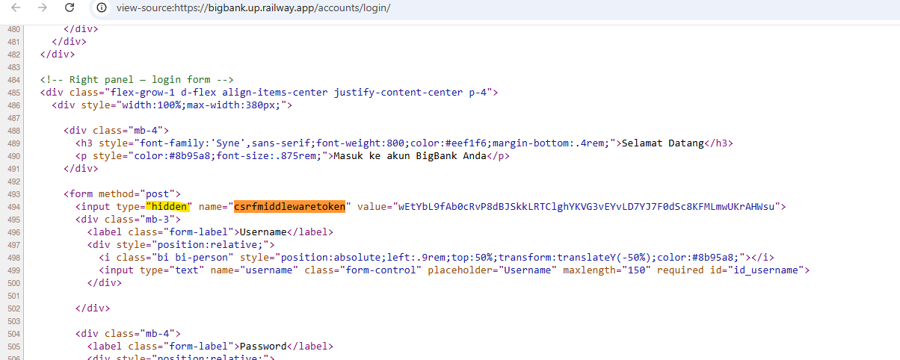


---

#### Temuan #4 — Broken Authentication

| | |
|-|-|
| **Reference No** | WEB_VUL_04 |
| **Kategori** | Broken Authentication |
| **Risk Rating** | High |
| **Endpoint** | `/accounts/login/`, `/accounts/dashboard/`, endpoint role-restricted |
| **Tools Used** | Browser, Django shell |

**Vulnerability Description:**
Broken Authentication mencakup kelemahan pada mekanisme autentikasi dan manajemen sesi, termasuk akses tanpa login, password yang tidak di-hash, session fixation, brute force, dan privilege escalation.

**Sub-pengujian dan Hasil:**

**4a. Akses URL tanpa login:**
Mengakses `/accounts/dashboard/` secara langsung tanpa login menghasilkan redirect HTTP 302 ke `/accounts/login/?next=/accounts/dashboard/`. Dekorator @login_required berfungsi dengan baik.

**4b. Password hashing:**
Melalui Django shell, CustomUser.objects.first().password mengembalikan pbkdf2_sha256$600000$... berarti password disimpan menggunakan algoritma PBKDF2 dengan SHA-256 dan 600.000 iterasi, sesuai standar keamanan Django terkini.

**4c. Session fixation:**
Session ID baru diterbitkan setelah login berhasil (sessionid=xz75tc1sfcm...) dan session lama dihapus setelah logout. Ini mencegah serangan session fixation.

**4d. Privilege escalation:**
User nasabah (Dewi Lestari) mencoba mengakses `/banking/antrian-transfer/` yang merupakan halaman khusus teller. Server mengembalikan redirect HTTP 302 ke dashboard dengan pesan "Anda tidak memiliki akses ke halaman ini."

**Implied / Consequences:**
Jika salah satu mekanisme di atas gagal, penyerang dapat mengakses data nasabah lain, menggunakan fitur yang bukan haknya, atau mengambil alih sesi aktif tanpa mengetahui password.

**Suggested Countermeasures:**
- Pastikan dekorator `@login_required` dan permission check diterapkan secara konsisten di semua view, termasuk view yang baru ditambahkan
- Pertahankan penggunaan PBKDF2 untuk hashing password
- Pertahankan mekanisme session regeneration setelah login dan logout
- Pertahankan AXES lockout setelah 6 kali percobaan gagal

**Status:** Protected

> Screenshot:
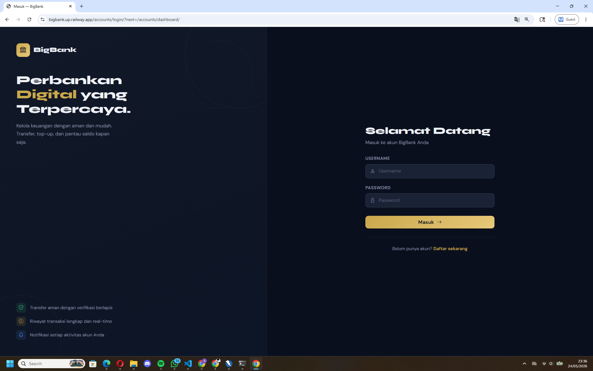


---

#### Ringkasan Hasil Exploitation

| No | Reference No | Vulnerability | Endpoint | Tools | Exploit Berhasil | Status |
|----|-------------|--------------|----------|-------|-----------------|--------|
| 1 | WEB_VUL_01 | SQL Injection | `/accounts/login/` | sqlmap, manual browser | Tidak | Protected |
| 2 | WEB_VUL_02 | XSS / Code Injection | `/banking/transfer/` | Manual browser | Tidak | Protected |
| 3 | WEB_VUL_03 | CSRF | `/banking/topup/`, `/accounts/login/` | Manual browser | Tidak | Protected |
| 4 | WEB_VUL_04 | Broken Authentication | `/accounts/login/`, `/accounts/dashboard/`, endpoint role-restricted | Browser, Django shell | Tidak | Protected |

---

### 6. Reporting & Remediation

#### 6.1 Host Analysis

##### Web Server
**A. Reconnaissance**
- Tool used: nmap
- IP address: 66.33.22.91
- Port: 80 (HTTP), 443 (HTTPS)
- Operating system: Linux (Railway infrastructure)
- Other software: Django (Python), Railway-edge (Golang net/http reverse proxy)

**B. Vulnerability Analysis**
- Tools used: OWASP ZAP, sqlmap, manual browser, Django shell
- Temuan: 10 alert dari ZAP (2 Medium, 4 Low, 4 Informational). Tidak ditemukan vulnerability kritis yang dapat dieksploitasi. Kelemahan utama bersifat konfigurasi header HTTP, yaitu CSP belum dikonfigurasi, cookie csrftoken tidak memiliki flag Secure dan HttpOnly, serta HSTS belum diterapkan.

**C. Exploitation**
- Tidak ada vulnerability yang berhasil dieksploitasi. Semua pengujian SQL Injection, XSS, CSRF, dan Broken Authentication menghasilkan status Protected.

**D. Recommendations**
- Tambahkan Content-Security-Policy header
- Tambahkan flag Secure dan HttpOnly pada cookie csrftoken
- Aktifkan Strict-Transport-Security (HSTS) header
- Tambahkan Subresource Integrity (SRI) attribute pada tag <link> dan <script> eksternal

---

#### 6.2 Tabel Temuan yang Terlindungi

| No | Vulnerability | Mekanisme Proteksi | Komponen |
|----|--------------|-------------------|----------|
| 1 | SQL Injection | Django ORM menggunakan parameterized queries secara default; validasi input client-side memblokir karakter khusus SQL; rate limiting (HTTP 429) mencegah automated attack | Django ORM, validators.py, django-axes |
| 2 | XSS / Code Injection | Validasi input client-side memblokir karakter `<`, `>`, `{`, `}` dan karakter HTML berbahaya; Django template auto-escaping aktif | validators.py, Django template engine |
| 3 | CSRF | Django CsrfViewMiddleware aktif; setiap form POST menyertakan csrfmiddlewaretoken; request tanpa token valid ditolak dengan HTTP 403 | django.middleware.csrf.CsrfViewMiddleware |
| 4 | Broken Authentication | @login_required decorator pada semua view terautentikasi; permission check untuk role teller/supervisor; PBKDF2-SHA256 untuk hashing password; session regeneration setelah login/logout; AXES lockout setelah 6 kali gagal | decorators.py, permission.py, django-axes, Django auth |

---

#### 6.3 Tabel Temuan yang Perlu Diperbaiki

| No | Temuan | Risk Rating | Status | Rekomendasi | Prioritas |
|----|--------|------------|--------|-------------|-----------|
| 1 | Content Security Policy (CSP) Header Not Set | Medium | Belum diperbaiki | Tambahkan header `Content-Security-Policy` di konfigurasi server atau Django middleware | High |
| 2 | Cookie csrftoken tanpa flag Secure dan HttpOnly | Low | Belum diperbaiki | Set `CSRF_COOKIE_SECURE = True` dan `CSRF_COOKIE_HTTPONLY = True` di settings.py | Medium |
| 3 | Strict-Transport-Security (HSTS) Header Not Set | Low | Belum diperbaiki | Tambahkan header `Strict-Transport-Security: max-age=31536000; includeSubDomains` | Medium |
| 4 | Sub Resource Integrity Attribute Missing | Medium | Belum diperbaiki | Tambahkan atribut `integrity` dan `crossorigin` pada tag `<link>` dan `<script>` untuk resource eksternal (Bootstrap, Google Fonts) | Medium |

---

#### 6.4 Rekomendasi Detail

##### Content Security Policy (CSP) Header Not Set
**Risk Rating:** Medium
**Deskripsi:** Aplikasi tidak mengonfigurasi header Content-Security-Policy, sehingga browser tidak memiliki instruksi untuk membatasi sumber konten yang boleh dimuat. Ini meningkatkan risiko XSS jika validasi client-side berhasil di-bypass.
**Rekomendasi:**
```python
# settings.py — tambahkan middleware django-csp
MIDDLEWARE = [
    ...
    'csp.middleware.CSPMiddleware',
]

CSP_DEFAULT_SRC = ("'self'",)
CSP_STYLE_SRC = ("'self'", "https://fonts.googleapis.com", "https://cdn.jsdelivr.net")
CSP_SCRIPT_SRC = ("'self'", "https://cdn.jsdelivr.net")
CSP_FONT_SRC = ("'self'", "https://fonts.gstatic.com")
```

##### Cookie csrftoken tanpa flag Secure dan HttpOnly
**Risk Rating:** Low
**Deskripsi:** Cookie csrftoken tidak memiliki flag Secure (dapat dikirim via HTTP) dan HttpOnly`(dapat dibaca JavaScript). Ini berpotensi mengekspos token jika terjadi serangan XSS atau koneksi tidak aman.
**Rekomendasi:**
```python
# settings.py
CSRF_COOKIE_SECURE = True    # hanya kirim via HTTPS
CSRF_COOKIE_HTTPONLY = True  # tidak bisa dibaca JavaScript
SESSION_COOKIE_SECURE = True # terapkan juga pada session cookie
```

##### Strict-Transport-Security (HSTS) Header Not Set
**Risk Rating:** Low
**Deskripsi:** Tanpa header HSTS, browser tidak dipaksa untuk selalu menggunakan HTTPS, sehingga ada potensi koneksi HTTP yang tidak terenkripsi.
**Rekomendasi:**
```python
# settings.py
SECURE_HSTS_SECONDS = 31536000
SECURE_HSTS_INCLUDE_SUBDOMAINS = True
SECURE_SSL_REDIRECT = True
```

---

#### 6.5 Kesimpulan
Penetration testing terhadap aplikasi BigBank (`https://bigbank.up.railway.app/`) dilakukan pada tanggal 24 Mei 2026 menggunakan pendekatan white box testing. Dari empat kategori pengujian utama, SQL Injection, XSS/Code Injection, CSRF, dan Broken Authentication, tidak ditemukan satu pun kerentanan yang berhasil dieksploitasi. Seluruh mekanisme proteksi yang diimplementasikan berfungsi dengan baik, termasuk Django ORM untuk mencegah SQL Injection, validasi input untuk memblokir XSS, CsrfViewMiddleware untuk menolak request CSRF, serta kombinasi @login_required, permission decorator, dan django-axes untuk menjaga integritas autentikasi. Meski demikian, terdapat beberapa temuan konfigurasi header HTTP yang perlu diperbaiki, yaitu CSP yang belum dikonfigurasi, cookie csrftoken tanpa flag Secure dan HttpOnly, serta HSTS yang belum diterapkan. Perbaikan pada ketiga temuan ini akan meningkatkan keamanan aplikasi secara signifikan meskipun tidak ada eksploitasi langsung yang ditemukan saat ini.

---